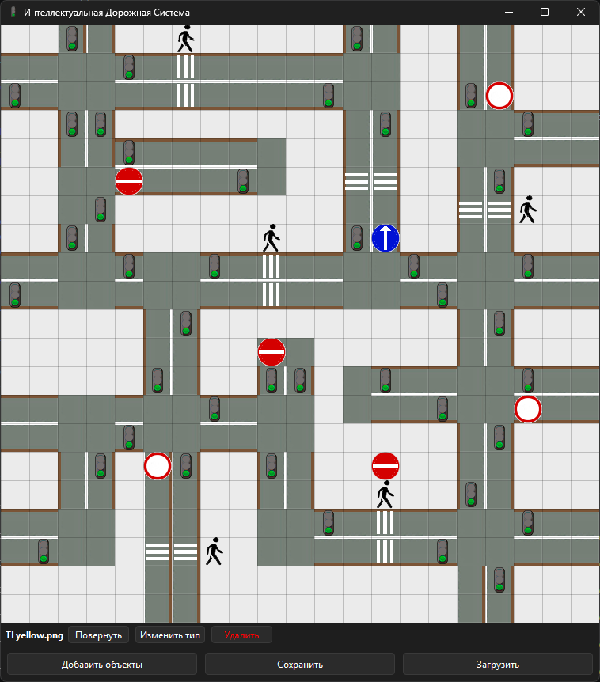
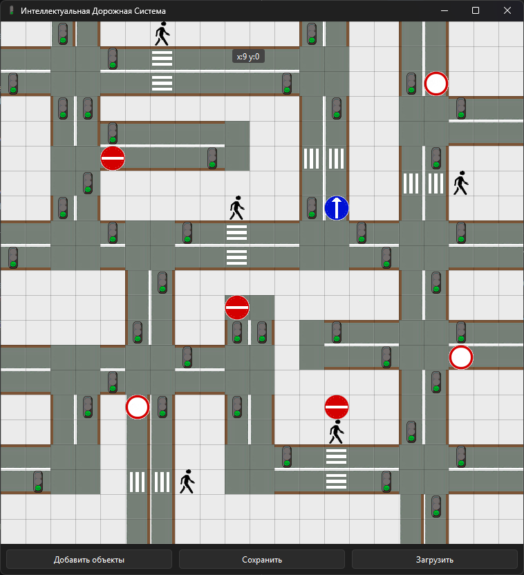

# Intelligent Integrated Systems Technician (09.02.08-1-2026)

<p align="center">
  
  
</p>

<p align="center">
  <b>Демонстрационный Экзамен - Методические Материалы </b>
</p>
<p align="center">
  <b>09.02.08 Интеллектуальные интегрированные системы (приказ №1095 от 12 декабря 2022) </b>
</p>

---

## 🔵 Ключевые файлы репозитория

- Образец задания ДЭ - [Перейти к файлу](https://github.com/SdvSeven/09.02.08-1-2026/blob/main/Образец%20задания%20для%20ГИА%20ДЭ%20БУ%2009.docx)
- Модуль 1 (Решение) - [Перейти к файлу](https://github.com/SdvSeven/09.02.08-1-2026/tree/main/module1)
- Модуль 2 (Решение) - [Перейти к файлу](https://github.com/SdvSeven/Demonstration_Exam_09.02.08/tree/main/module2)
- Методическе пособие "Модуль 1" - [Перейти к файлу](https://github.com/SdvSeven/Demonstration_Exam_09.02.08/blob/main/Методическое_пособие_Модуль1.docx)
- Методические пособие "Модуль 1, 2" - [Перейти к файлу](https://github.com/SdvSeven/Demonstration_Exam_09.02.08/blob/main/Методическое_пособие_Модули_1_2.docx)
- Критерии оценки модулей - [Перейти к файлу](https://github.com/SdvSeven/Demonstration_Exam_09.02.08/blob/main/Схема%20Оценки.xlsx)

---

# 🔵 Модуль 1
<p align="center">
  
</p>
<p align="center">
  <b>Интерфейс программы 'Модуль 1'</b>
</p>

### Возможности
- **Сетка** 21×21 клеток (размер клетки — 36 пикселей)
- **Редактор дороги** — размещение дорожного полотна
- **Добавить объекты** — размещение объектов (пешеходы, светофоры, знаки и др.)
- **Поворот объектов** — кратно 90° для поддерживаемых объектов
- **Смена типа объекта** — циклическое переключение (например, цвет светофора)
- **Скорость** — настройка параметра для пешеходов
- **Сохранение / Загрузка** карты в формате `.json`

### Формат файла сохранения (JSON) - карта

```json
{
  "roads": {
    "x,y": { "path": "...", "base": "...", "rot": 0 }
  },
  "objs": {
    "x,y": { "path": "...", "base": "...", "rot": 0, "speed": 0 }
  }
}
```

### Требования

| Компонент | Версия |
|-----------|--------|
| Python    | 3.10+  |
| PyQt6     | 6.4+   |

### Установка зависимостей
```bash
pip install PyQt6
```

---

# 🔵 Модуль 2
<p align="center">
  
</p>
<p align="center">
  <b>Интерфейс программы 'Модуль 2'</b>
</p>

### Возможности
- **Сетка** 21×21 клеток (размер клетки — 36 пикселей)
- **Редактор дороги** — размещение дорожного полотна
- **Добавить объекты** — размещение объектов (пешеходы, светофоры, знаки и др.)
- **Поворот объектов** — кратно 90° для поддерживаемых объектов
- **Смена типа объекта** — циклическое переключение (например, цвет светофора)
- **Скорость** — настройка параметра для пешеходов
- **Сохранение / Загрузка** карты в формате `.json`
- **Ручной режим светофора** - ручное переключение светофора (синхронно с Arduino)
- **Ручной режим светофора** - авто. переключение светофора каждые 3 секунды (синхронно с Arduino)

###  Схема подключения Arduino для Модуля 2

| Arduino | Компонент         | Назначение  |
|---------|-------------------|-------------|
| Pin 8   | → 220Ω → LED (+)  | Красный     |
| Pin 9   | → 220Ω → LED (+)  | Жёлтый      |
| Pin 10  | → 220Ω → LED (+)  | Зелёный     |
| GND     | ← LED (−)         | Все три LED |

### Требования

| Компонент        | Версия / Условие            |
|------------------|----------------------------|
| Python           | 3.10+                      |
| PyQt6            | 6.4+                       |
| SQLite           | встроен в Python           |
| pyserial         | опционально (для Arduino)  |
| Операционная система | Windows / Linux / macOS |
| Arduino          | опционально                |
### Установка зависимостей
```bash
pip install PyQt6 pyserial
```

### ***Этот репозиторий не представляет собой официальную структуру. Он содержит учебные материалы для рекомендаций. Автор не отвечает за итоговые решения.***
### *Вы можете задать свои вопросы в разделе «Дискуссии».*
